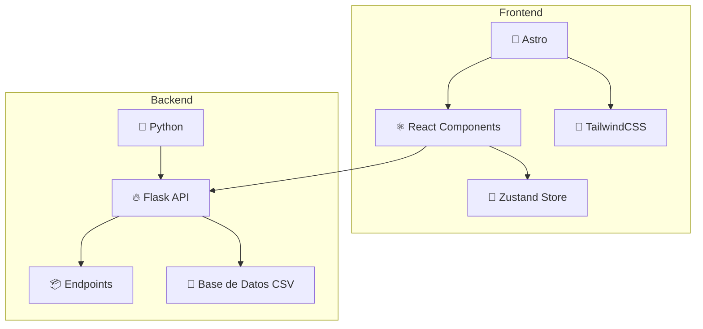

# 🎉 **Hoy Pasa Algo** - Eventos Locales en Tiempo Real

<div align="center">


**🚀 Plataforma web moderna para descubrir eventos locales en tu ciudad, con un backend potente en Python.**

[📖 Ver Demo](#) • [🛠️ Instalación](#instalación) • [📋 Características](#características)

</div>

---

## 🎯 **Planteamiento del Problema**

> **¿Te has perdido de eventos geniales en tu ciudad por no enterarte a tiempo?**

### 🚨 **Problemas Identificados:**

- 📍 **Visibilidad limitada**: Los eventos solo son conocidos por quienes pasan físicamente por el lugar
- ⏰ **Información desactualizada**: Cambios de horarios o cancelaciones no se comunican efectivamente
- 🔍 **Falta de centralización**: No existe una plataforma única para descubrir eventos locales
- 💰 **Oportunidades perdidas**: Descuentos y promociones especiales pasan desapercibidos

---

## 🌟 **Introducción**

**Hoy Pasa Algo** es una plataforma web desarrollada como **MVP (Producto Mínimo Viable)** que revoluciona la forma en que descubres y compartes eventos locales.

### ✨ **¿Qué hace diferente a nuestra plataforma?**

| Característica | Beneficio |
|---|---|
| 🔄 **Tiempo Real** | Información actualizada al instante |
| 🎨 **Interfaz Moderna** | Experiencia de usuario intuitiva y atractiva |
| 📱 **Totalmente Responsiva** | Funciona perfectamente en cualquier dispositivo |
| 🏷️ **Categorización Inteligente** | Encuentra exactamente lo que buscas |
| ⚡ **Carga Ultrarrápida** | Powered by Astro para máximo rendimiento |
| 🐍 **Backend Robusto** | API RESTful con Flask y Python |

---

## 🎯 **Objetivos**

### 🎪 **Objetivo General**
> Desarrollar una aplicación web moderna que permita a personas y negocios **publicar y consultar eventos** de manera sencilla, organizados por fecha y categoría.

### 📋 **Objetivos Específicos**

- ✅ **Interfaz Intuitiva**
  - Menú superior e inferior fácil de navegar
  - Diseño centrado en la experiencia del usuario

- 🔧 **Sistema de Filtros Avanzado**
  - 🍕 Por categoría: comida, servicios, deportes, cultura, etc.
  - 📅 Por fecha: hoy, mañana, esta semana, próximos eventos

- 🎴 **Tarjetas de Evento Dinámicas**
  - Información clave visible de un vistazo
  - Botones de interacción (❤️ favoritos, 👍 likes)
  - Imágenes atractivas y descripciones concisas

- ⚡ **Publicación Rápida**
  - Formulario intuitivo para crear eventos
  - Validación en tiempo real
  - Proceso optimizado para negocios locales

- 🏗️ **Arquitectura Moderna**
  - MVP funcional con tecnologías de vanguardia
  - Escalable y mantenible

---

## 🛠️ **Metodología y Stack Tecnológico**

### 💻 **Frontend**

| Tecnología | Propósito |
|---|---|
|  | **Astro** - Estructura general del sitio, SSR |
|  | **React** - Componentes interactivos |
|  | **TailwindCSS** - Estilos rápidos y responsivos |
|  | **Zustand** - Gestión de estado global |
|  | **Vitest** - Pruebas unitarias y de integración |

### 🌐 **Backend**

| Tecnología | Propósito |
|---|---|
|  | **Python** - Lenguaje principal del backend |
|  | **Flask** - Framework para la API RESTful |
|  | **Pytest** - Pruebas para el backend |

---

## 🏗️ **Arquitectura del Software**



### 📂 **Estructura de Carpetas**

```
.
├── backend/
│   ├── app.py
│   ├── routes/
│   ├── models/
│   ├── tests/
│   └── ...
├── src/
│   ├── components/
│   ├── pages/
│   ├── stores/
│   └── ...
├── README.md
└── ...
```

---

## 🏆 **Resultados Obtenidos**

### ✅ **Características Implementadas**

| Feature | Estado | Descripción |
|---|---|---|
| 🖼️ **Interfaz Responsiva** | ✅ Completado | Filtros visibles y funcionales desde el inicio |
| 🎫 **Cards de Eventos** | ✅ Completado | Info rápida: imagen, hora, ubicación y favoritos |
| ➕ **Sistema de Creación** | ✅ Completado | Formulario funcional con validación básica |
| ↔️ **API Backend** | ✅ Completado | API RESTful con Python y Flask para gestionar eventos y usuarios |
| 🧪 **Pruebas** | ✅ Completado | Pruebas unitarias y de integración para frontend y backend |

---

## 🚀 **Instalación**

### 📋 **Prerrequisitos**

- Node.js >= 18.0.0
- pnpm >= 8.0.0
- Python >= 3.10
- uv >= 0.1.15

### ⚡ **Instalación y Ejecución**

1. **Clona el repositorio:**
   ```bash
   git clone https://github.com/tu-usuario/hoy-pasa-algo.git
   cd hoy-pasa-algo
   ```

2. **Backend (Python):**
   ```bash
   cd backend
   uv sync
   uv run flask --app app run --debug
   ```
   La API estará disponible en `http://localhost:5000`.

3. **Frontend (Astro + React):**
   En otra terminal:
   ```bash
   # Instala dependencias del frontend
   pnpm install

   # Inicia el servidor de desarrollo
   pnpm dev
   ```
   El frontend estará disponible en `http://localhost:4321`.

### 🔧 **Scripts Disponibles**

| Comando | Descripción |
|---|---|
| `pnpm dev` | 🚀 Servidor de desarrollo del frontend |
| `pnpm build` | 📦 Build de producción del frontend |
| `pnpm test` | 🧪 Ejecuta las pruebas del frontend con Vitest |
| `cd backend && uv run pytest` | 🧪 Ejecuta las pruebas del backend con Pytest |

---

## 🔮 **Roadmap Futuro**

- [ ] 🔐 **Autenticación de usuarios mejorada**
- [ ] 💾 **Migrar a una base de datos SQL**
- [ ] 🔔 **Notificaciones push**
- [ ] 🗺️ **Integración con mapas**
- [ ] 💬 **Sistema de comentarios**

---

<div align="center">

### 🤝 **¿Te gustó el proyecto?**

[](https://github.com/tu-usuario/hoy-pasa-algo)

**¡Hecho con ❤️ para la comunidad local!**

</div>