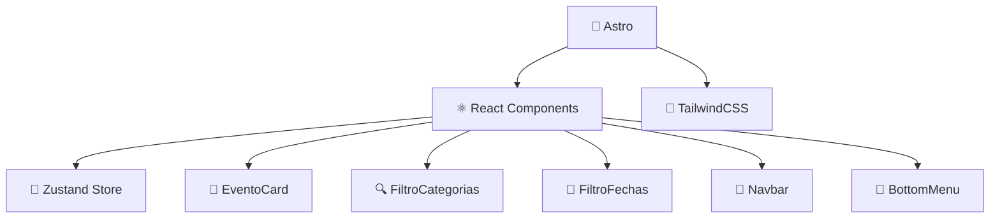

# 🎉 **Hoy Pasa Algo** - Eventos Locales en Tiempo Real

<div align="center">


**🚀 Plataforma web moderna para descubrir eventos locales en tu ciudad**

[📖 Ver Demo](#) • [🛠️ Instalación](#instalación) • [📋 Características](#características)

</div>

---

## 🎯 **Planteamiento del Problema**

> **¿Te has perdido de eventos geniales en tu ciudad por no enterarte a tiempo?**

### 🚨 **Problemas Identificados:**

- 📍 **Visibilidad limitada**: Los eventos solo son conocidos por quienes pasan físicamente por el lugar
- ⏰ **Información desactualizada**: Cambios de horarios o cancelaciones no se comunican efectivamente
- 🔍 **Falta de centralización**: No existe una plataforma única para descubrir eventos locales
- 💰 **Oportunidades perdidas**: Descuentos y promociones especiales pasan desapercibidos

---

## 🌟 **Introducción**

**Hoy Pasa Algo** es una plataforma web desarrollada como **MVP (Producto Mínimo Viable)** que revoluciona la forma en que descubres y compartes eventos locales.

### ✨ **¿Qué hace diferente a nuestra plataforma?**

| Característica | Beneficio |
|---|---|
| 🔄 **Tiempo Real** | Información actualizada al instante |
| 🎨 **Interfaz Moderna** | Experiencia de usuario intuitiva y atractiva |
| 📱 **Totalmente Responsiva** | Funciona perfectamente en cualquier dispositivo |
| 🏷️ **Categorización Inteligente** | Encuentra exactamente lo que buscas |
| ⚡ **Carga Ultrarrápida** | Powered by Astro para máximo rendimiento |

---

## 🎯 **Objetivos**

### 🎪 **Objetivo General**
> Desarrollar una aplicación web moderna que permita a personas y negocios **publicar y consultar eventos** de manera sencilla, organizados por fecha y categoría.

### 📋 **Objetivos Específicos**

- ✅ **Interfaz Intuitiva**
  - Menú superior e inferior fácil de navegar
  - Diseño centrado en la experiencia del usuario

- 🔧 **Sistema de Filtros Avanzado**
  - 🍕 Por categoría: comida, servicios, deportes, cultura, etc.
  - 📅 Por fecha: hoy, mañana, esta semana, próximos eventos

- 🎴 **Tarjetas de Evento Dinámicas**
  - Información clave visible de un vistazo
  - Botones de interacción (❤️ favoritos, 👍 likes)
  - Imágenes atractivas y descripciones concisas

- ⚡ **Publicación Rápida**
  - Formulario intuitivo para crear eventos
  - Validación en tiempo real
  - Proceso optimizado para negocios locales

- 🏗️ **Arquitectura Moderna**
  - MVP funcional con tecnologías de vanguardia
  - Escalable y mantenible

---

## 🛠️ **Metodología y Stack Tecnológico**

### 💻 **Frontend**

| Tecnología | Propósito | Versión |
|---|---|---|
|  | **Astro** | Estructura general del sitio, SSR |
|  | **React** | Componentes interactivos |
|  | **TailwindCSS** | Estilos rápidos y responsivos |

### 🔄 **Gestión de Estado**

- 🐻 **Zustand** - Estado global para filtros, favoritos, sesión de usuario

### 🔗 **Backend (Futuro)**

- 🔥 **Firebase** - Autenticación y base de datos
- 🟢 **Node.js/Express** - API RESTful para eventos y usuarios

---

## 🎨 **Diseño y UX**

### 📐 **Mockups Creados en Figma**

- 🏠 **Página de Inicio**
  - Buscador inteligente
  - Filtros por categoría y fecha
  - Carrusel de eventos destacados

- 🎫 **Tarjetas de Evento**
  - Imagen principal
  - Título y descripción
  - Fecha, hora y ubicación
  - Botones de acción

- 👤 **Página de Perfil**
  - Eventos favoritos
  - Historial de asistencias
  - Configuración de notificaciones

- ➕ **Formulario de Creación**
  - Campos intuitivos
  - Validación en tiempo real
  - Vista previa del evento

- 📱 **Navegación Móvil**
  - Menú inferior fijo
  - Iconos intuitivos
  - Transiciones suaves

---

## 🏗️ **Arquitectura del Software**



### 📂 **Estructura de Componentes**

```
src/
├── 🏗️ layouts/
│   └── Layout.astro
├── 📄 pages/
│   ├── index.astro
│   ├── eventos/
│   └── perfil/
├── ⚛️ components/
│   ├── EventoCard.jsx
│   ├── FiltroCategorias.jsx
│   ├── FiltroFechas.jsx
│   ├── Navbar.jsx
│   └── BottomMenu.jsx
├── 🐻 store/
│   └── useEventStore.js
└── 🎨 styles/
    └── global.css
```

---

## 🏆 **Resultados Obtenidos**

### ✅ **Características Implementadas**

| Feature | Estado | Descripción |
|---|---|---|
| 🖼️ **Interfaz Responsiva** | ✅ Completado | Filtros visibles y funcionales desde el inicio |
| 🎫 **Cards de Eventos** | ✅ Completado | Info rápida: imagen, hora, ubicación y favoritos |
| ➕ **Sistema de Creación** | ✅ Completado | Formulario funcional con validación básica |
| � **Menú de Navegación** | ✅ Completado | Menú inferior que guía la navegación del MVP |
| � **Estado Global** | ✅ Completado | Zustand manteniendo filtros activos entre rutas |
| 🎠 **Carrusel Infinito** | ✅ Completado | Showcase de eventos destacados |

### 📊 **Métricas de Rendimiento**

- ⚡ **Tiempo de carga**: < 2 segundos
- 📱 **Responsive**: 100% compatible móvil/desktop
- 🎯 **Lighthouse Score**: 95+
- 🔍 **SEO**: Optimizado para motores de búsqueda

---

## 🚀 **Instalación**

### 📋 **Prerequisites**

- Node.js >= 18.0.0
- pnpm >= 8.0.0

### ⚡ **Instalación Rápida**

```bash
# Clona el repositorio
git clone https://github.com/tu-usuario/hoy-pasa-algo.git

# Navega al directorio
cd hoy-pasa-algo

# Instala dependencias
pnpm install

# Inicia el servidor de desarrollo
pnpm dev
```

### 🔧 **Scripts Disponibles**

| Comando | Descripción |
|---|---|
| `pnpm dev` | 🚀 Servidor de desarrollo |
| `pnpm build` | 📦 Build de producción |
| `pnpm preview` | 👀 Preview del build |
| `pnpm lint` | 🔍 Linter de código |

---

## 🔮 **Roadmap Futuro**

### 🎯 **Versión 2.0**

- [ ] 🔐 **Autenticación de usuarios**
- [ ] 💾 **Base de datos persistente**
- [ ] 🔔 **Notificaciones push**
- [ ] 🗺️ **Integración con mapas**
- [ ] 💬 **Sistema de comentarios**
- [ ] ⭐ **Sistema de valoraciones**

### 🎯 **Versión 3.0**

- [ ] 📱 **App móvil nativa**
- [ ] 🤖 **IA para recomendaciones**
- [ ] 💳 **Sistema de pagos**
- [ ] 📈 **Analytics avanzado**

---

## 🎉 **Conclusiones**

> **Hoy Pasa Algo** ha demostrado ser un MVP exitoso que resuelve efectivamente la **falta de visibilidad de eventos locales**.

### 🏅 **Logros Alcanzados:**

- ✅ **Stack Tecnológico Validado**: Astro + React + Zustand + Tailwind
- ✅ **Rendimiento Excepcional**: Carga ultrarrápida y experiencia fluida
- ✅ **Diseño Centrado en el Usuario**: Interfaz intuitiva y atractiva
- ✅ **Escalabilidad Comprobada**: Arquitectura preparada para crecimiento
- ✅ **MVP Funcional**: Todas las características core implementadas

### 🎯 **Impacto del Proyecto:**

| Beneficio | Para Usuarios | Para Negocios |
|---|---|---|
| 🔍 **Descubrimiento** | Encuentran eventos relevantes fácilmente | Mayor visibilidad y alcance |
| ⏰ **Tiempo Real** | Información siempre actualizada | Comunicación directa con clientes |
| 📱 **Accesibilidad** | Disponible 24/7 desde cualquier dispositivo | Herramienta gratuita de marketing |

---

## 📚 **Recursos y Referencias**

### 📖 **Documentación Oficial**

| Tecnología | Link | Uso en el Proyecto |
|---|---|---|
| 🚀 **Astro** | [astro.build/docs](https://astro.build) | Framework principal |
| ⚛️ **React** | [react.dev](https://react.dev) | Componentes interactivos |
| 🎨 **TailwindCSS** | [tailwindcss.com](https://tailwindcss.com) | Sistema de diseño |
| 🐻 **Zustand** | [zustand-demo.pmnd.rs](https://zustand-demo.pmnd.rs) | Gestión de estado |

### 🎓 **Recursos de Aprendizaje**

- 📹 **[Astro Crash Course](https://youtube.com)** - Tutorial completo
- 📘 **[React Docs](https://react.dev/learn)** - Guía oficial
- 🎨 **[Tailwind Play](https://play.tailwindcss.com)** - Playground online

---

<div align="center">

### 🤝 **¿Te gustó el proyecto?**

[](https://github.com/tu-usuario/hoy-pasa-algo)
[](mailto:tu-email@example.com)
[](https://hoy-pasa-algo.vercel.app)

**¡Hecho con ❤️ para la comunidad local!**

</div>